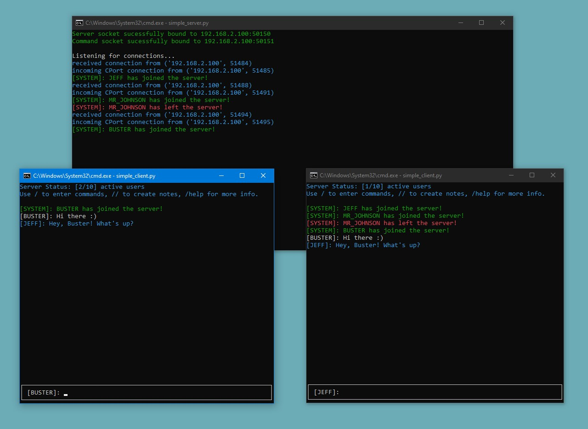
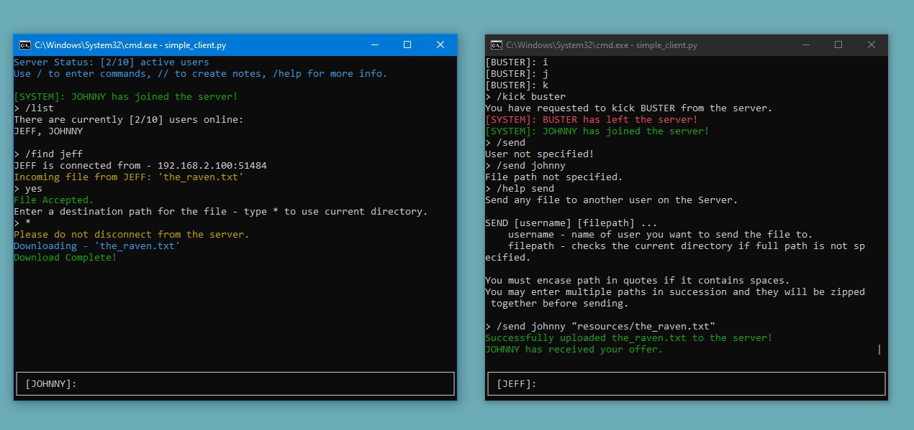

# 💬 Simple Chatroom & File-Sharing Server

A Python-based chat client-server application designed for communication between multiple users. 

The system features both a custom-built terminal UI (on top of `ncurses`) and a lightweight network protocol for secure and reliable message exchanges.

*Figure 1: Real-time chat with users over the network*

### Features

- Real-time messaging

- User authentication with validation

- File-sharing requests between users

- Fully interactive terminal UI via a custom `mycurses` engine

- Auto-reconnect and graceful error handling ensures that the client can recover from common network failures

- Dual-socket architecture for message & command handling (for advanced interactions with other users)

- Smart input system: supports prompts, timeouts, and binary (Y/N) responses

## Usage

The server and client operate in custom terminals built using __ncurses__.

You may run the script `mycurses.py` directly for a demo on how to use the text-based UI.

🛠️ __Setup:__

1. Git clone this repository

1. Run the Simple Server:

		python simple_server.py
		
	- Press `Alt + D` to open the server's command box

	- Enter `/end` or `/quit` to gracefully shut down the server

1. Launch a Simple Client:

		python simple_client.py

	Follow the on-screen instructions for authentication and communication.

	- When you run the client, it will attempt to connect to the server locally

	- Upon connection, the server will request a unique and valid username

	- Once authenticated, users can send and receive messages in real-time

	- The application also supports command functions:

		- Use `\help` for a list of available commands
		- Use `\help cmd` to learn more about any `cmd`

	 

	

	*Figure 2: Accepting file requests directly from another user*

## Architecture
The system follows a simple client-server model:

__Client:__ 

- Handles user input, manages authentication, and communicates with the server. 

- Each user is assigned a unique username after successful authentication.

__Server:__ 

- Manages incoming connections, user authentication, and broadcasts messages to clients.

- Handles command routing through a dedicated socket.

### Authentication Process:
1. Client connects to main socket and receives welcome message

1. User creates a valid, unique username

1. A second socket is created for command communication

1. Server confirms and grants access to chatroom

